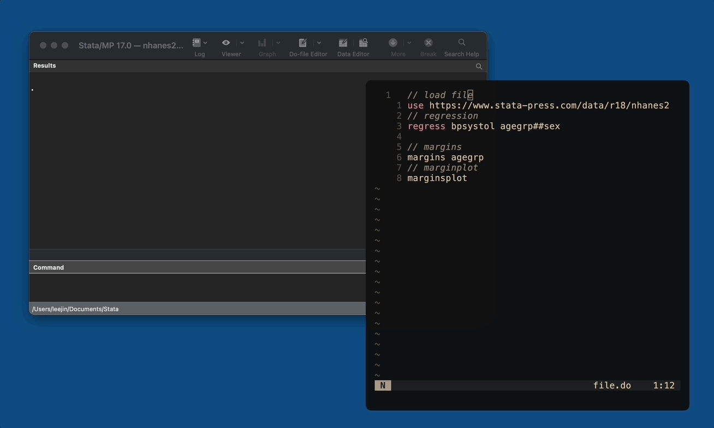

# do-stata.nvim


Neovim plugin that sends code in the current buffer to Stata GUI

## WIP
Currently this only works for macOS. 

I do not have Windows PC with Stata installed but would love to add Windows and Linux support soon!

This is also my first attempt in making neovim plugin so I suspect there is lots of room for improvement.

## Problem
I have been using Jupyter kernel for Stata ([stata_kernel](https://github.com/kylebarron/stata_kernel)) and VS Code (with vim bindings of course).
But this had few hiccups such as:
- long outputs (such as regression table with many variables) are truncated.
- Jupyter outputs for stata are just plain-text, which I have to use Stata logs to copy tables to other programs (Word, Excel, etc.)
- Figure support has some quarks

## Solution
Neovim all the way!

## Installation
Install using plugin manager of your choice (Lazy.nvim in my case).

```lua
  {
    "leerauljin/do-stata.nvim",
    opts = { stata_ver = "StataMP" }
    ft = { "stata" }
  }
```

## Configuration
You need to set config variable “stata_ver” to specify your version of Stata installation. Supported options are:
- StataBE
- StataSE
- StataMP

## Keybindings
Default keybinding is <leader>r for both normal and visual mode. 

### Normal mode
\<leader\>r runs entire file

### Visual mode
\<leader\>r runs selected line(s), from beginning row of selection to the end row. 

### Custom bindings
This comes with custom command :DoStata, which can be used to create custom bindings. Same command is used for normal and visual mode.

```lua
vim.keymap.set("n", "<leader>r", "<cmd>DoStata<cr>")
vim.keymap.set("v", "<leader>r", "<cmd>DoStata<cr>")
```

## How this plugin works
1. Check if current mode is normal or visual
2. If it is normal mode, parse entire current buffer. If it is visual mode, parse beginning row of selection to the end row.
3. Parsed lines (in text form) is sent to a temporary do file.
4. Run that do file using AppleScript. This opens new Stata window if Stata is not running. If Stata is running, focus is moved to currently open Stata window.
5. When you close neovim instance, temporary files are deleted.